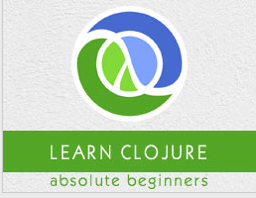

```
Roberto Nogueira  
BSd EE, MSd CE
Solution Integrator Experienced - Certified by Ericsson
```
# Tutorialspoint Closure



**About This Course**

Learn everything you need to about Closure.

[Closure Tutorial](https://www.tutorialspoint.com/clojure/index.htm)

## Topics
```
Clojure Tutorial
[ ] Home
[ ] Overview
[ ] Environment
[ ] Basic Syntax
[ ] REPL
[ ] Data Types
[ ] Variables
[ ] Operators
[ ] Loops
[ ] Decision Making
[ ] Functions
[ ] Numbers
[ ] Recursion
[ ] File I/O
[ ] Strings
[ ] Lists
[ ] Sets
[ ] Vectors
[ ] Maps
[ ] Namespaces
[ ] Exception Handling
[ ] Sequences
[ ] Regular Expressions
[ ] Predicates
[ ] Destructuring
[ ] Date & Time
[ ] Atoms
[ ] Metadata
[ ] StructMaps
[ ] Agents
[ ] Watchers
[ ] Macros
[ ] Reference Values
[ ] Databases
[ ] Java Interface
[ ] Concurrent Programming
[ ] Applications
[ ] Automated Testing
[ ] Libraries
Clojure Useful Resources
[ ] Quick Guide
[ ] Useful Resources
[ ] Discussion
Selected Reading
[ ] Developer's Best Practices
[ ] Questions and Answers
[ ] Effective Resume Writing
[ ] HR Interview Questions
[ ] Computer Glossary
[ ] Who is Who
```
